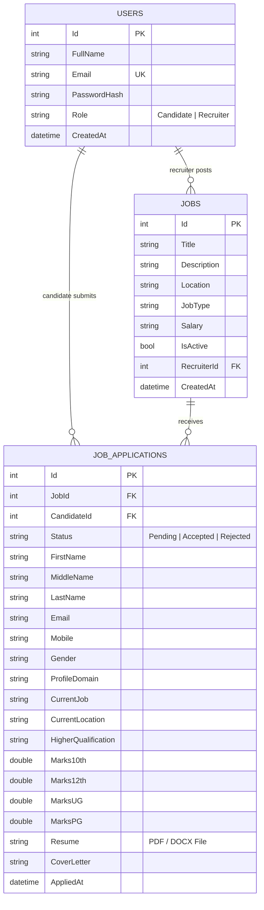

<div align="center">

# 🚀 HireFlow

### *Next-Generation Career & Recruitment Platform*

[](https://dotnet.microsoft.com/)
[](https://learn.microsoft.com/en-us/dotnet/csharp/)
[](https://learn.microsoft.com/en-us/ef/core/)
[](https://jwt.io/)
[](https://developer.mozilla.org/)
[](LICENSE)

<br />

<p align="center">
  <strong>HireFlow</strong> is a modern, full-stack career discovery and applicant management ecosystem designed for the modern tech workforce. Bridging the gap between ambitious IT candidates and top-tier recruiters with real-time job exploration, structured candidate vetting, role-based workflows, and a sleek glassmorphic UI.
</p>

[Explore Features](#-key-features) • [Tech Stack](#-technology-stack) • [Database Architecture](#-database-architecture) • [API Endpoints](#-api-endpoints) • [Quick Start](#-quick-start-guide)

</div>

---

## 🌟 Key Features

### 👤 1. Candidate Experience
- **Interactive Job Explorer:** Live keyword search, dynamic location filtering, and category pills (Full Stack, DevOps, AI/Data Science, Mobile, Cybersecurity, QA, etc.).
- **Smart Application Modal:** Comprehensive multi-stage candidate application form:
  - **Personal Details:** Full name (First, Middle, Last), Email, Mobile, Gender.
  - **Professional Background:** IT Profile domain, Current Designation/Job, Current Location.
  - **Academic Records:** Higher Qualification selector, 10th (%), 12th (%), UG (%), and PG (%) marks.
  - **Document Attachment with Strict Validation:** Strict client-side and server-side verification allowing **only PDF (`.pdf`) and Word (`.docx`, `.doc`)** documents.
  - **Cover Letter & Pitch:** Custom personalized pitch directly delivered to the hiring team.
- **Candidate Command Center:** Track application statuses in real-time (`Pending Review ⏱️`, `Shortlisted / Accepted 🎉`, `Declined ❌`) with visual multi-step progress steppers.

### 🏢 2. Recruiter Command Center
- **Job Posting & Publishing:** Create and broadcast new vacancies with custom compensation ranges, job types (Remote, Full Time, Contract, Internship), and detailed tech stack requirements.
- **Applicant Review & Candidate Dossier:** View rich structured applicant cards including academic percentage records, location, contact details, resume badge, and cover letters.
- **Decision Workflow:** One-click application status decisions (`Accept`, `Reject`, `In-Review`) with instant notification feedback.
- **Direct Candidate Reach-out:** Built-in mailto triggers directly opening hiring manager conversations.

### 🔒 3. Enterprise Security & Architecture
- **JWT (JSON Web Token) Authentication:** Cryptographically signed stateless bearer tokens with expiration handling.
- **Role-Based Access Control (RBAC):** Strict policy separation between `Candidate` and `Recruiter` roles across all controller actions.
- **Repository-Service Pattern:** Clean architecture separating data persistence, business logic services, and presentation controllers.
- **Password Security:** Salted SHA-256 / BCrypt cryptographic hashing protecting user credentials.

### 🎨 4. Premium Modern UI/UX
- **Glassmorphism & Depth:** Tailored semi-transparent cards, backdrop blurs (`backdrop-filter: blur(12px)`), and subtle ambient glow effects.
- **Dark / Light Theme Switcher:** Real-time theme toggle persisted seamlessly in local storage.
- **Micro-Animations & Responsive Design:** Smooth transitions, floating badge physics, and a 100% mobile-friendly responsive layout.

---

## 🛠️ Technology Stack

| Layer | Technology | Description |
| :--- | :--- | :--- |
| **Backend Framework** | **ASP.NET Core 10 Web API** | High-performance, cross-platform enterprise RESTful API |
| **Language** | **C# 13 / .NET 10** | Modern, type-safe, asynchronous programming |
| **ORM** | **Entity Framework Core** | Code-first data mapping, migrations, and relationship management |
| **Database** | **SQLite (`HireFlow.db`)** | Embedded relational database with foreign key enforcement |
| **Security & Auth** | **JWT Bearer + BCrypt** | Token-based stateless authentication & role authorization |
| **Frontend Core** | **Vanilla HTML5 & ES6+ JavaScript** | Ultra-fast, zero-dependency browser performance |
| **Styling** | **Custom CSS3 Design Tokens** | Glassmorphism, CSS Grid, Flexbox, CSS Custom Properties |

---

## 🗄️ Database Architecture

HireFlow features a fully relational schema managed via Entity Framework Core:



---

## 🌐 API Endpoints

### 🔐 Authentication (`/api/Auth`)
| Method | Endpoint | Access | Description |
| :--- | :--- | :--- | :--- |
| `POST` | `/api/Auth/register` | Public | Register new Candidate or Recruiter |
| `POST` | `/api/Auth/login` | Public | Authenticate credentials and receive JWT |
| `GET` | `/api/Auth/me` | Authenticated | Retrieve current user profile from token |

### 💼 Jobs (`/api/Job`)
| Method | Endpoint | Access | Description |
| :--- | :--- | :--- | :--- |
| `GET` | `/api/Job` | Public | Fetch all active job listings |
| `GET` | `/api/Job/{id}` | Public | Get detailed specifications for a job |
| `POST` | `/api/Job` | Recruiter | Publish a new job vacancy |
| `GET` | `/api/Job/my-jobs` | Recruiter | Get listings published by logged-in recruiter |
| `PUT` | `/api/Job/{id}` | Recruiter | Update existing job details |
| `DELETE`| `/api/Job/{id}` | Recruiter | Remove / close a job vacancy |

### 📄 Applications (`/api/Application`)
| Method | Endpoint | Access | Description |
| :--- | :--- | :--- | :--- |
| `POST` | `/api/Application/apply/{jobId}` | Candidate | Submit application with marks, resume & location |
| `GET` | `/api/Application/my-applications`| Candidate | Get all applications submitted by candidate |
| `GET` | `/api/Application/job/{jobId}` | Recruiter | View all applicants for a specific job listing |
| `GET` | `/api/Application/recruiter-applications` | Recruiter | View all applicants across all recruiter's jobs |
| `PUT` | `/api/Application/{id}/status` | Recruiter | Update status (`Pending`, `Accepted`, `Rejected`) |

---

## 📁 Project Directory Structure

```plaintext
HireFlow/
├── HireFlow.slnx                      # Solution Configuration
├── .gitignore                         # Git exclusion rules
├── README.md                          # Repository Documentation
└── HireFlow/                          # Main Application Project
    ├── Controllers/                   # Web API REST Controllers
    │   ├── ApplicationController.cs   # Application submission & review endpoints
    │   ├── AuthController.cs          # Register, Login & JWT issuance
    │   ├── JobController.cs           # Job listings CRUD endpoints
    │   └── UserController.cs          # User profile endpoints
    ├── Data/                          # Database Context & Seeding
    │   ├── ApplicationDbContext.cs    # EF Core DB context & entity relationships
    │   └── DbSeeder.cs                # 50+ pre-seeded realistic IT job vacancies
    ├── DTOs/                          # Data Transfer Objects
    │   ├── Application/               # ApplyJobRequestDto, ApplicationResponseDto
    │   ├── Auth/                      # Login & Register DTOs
    │   └── Job/                       # Job request & response DTOs
    ├── Models/                        # Entity Domain Models
    │   ├── Job.cs                     # Job listing entity
    │   ├── JobApplication.cs          # Complete application & academic record entity
    │   └── User.cs                    # User account entity
    ├── Repositories/                  # Data Access Abstraction Layer
    ├── Services/                      # Core Business Logic Layer
    ├── Migrations/                    # Entity Framework Core Migration files
    ├── Program.cs                     # App bootstrap, middleware pipeline & DI
    ├── appsettings.json               # Database connection string & JWT secret
    └── wwwroot/                       # Static Frontend Assets
        ├── index.html                 # Main Job Discovery & Application UI
        ├── profile.html               # Candidate & Recruiter Command Center
        ├── CSS/
        │   └── style.css              # Custom design system & glassmorphism theme
        └── JS/
            └── app.js                 # Frontend business logic, state & API client
```

---

## 🚀 Quick Start Guide

### Prerequisites
- [.NET 10 SDK](https://dotnet.microsoft.com/download) installed on your machine.
- Any modern web browser (Google Chrome, Microsoft Edge, Mozilla Firefox, Brave).

### 1. Clone the Repository
```bash
git clone https://github.com/Anand9899/HireFlow.git
cd HireFlow/HireFlow
```

### 2. Run the Application
```bash
dotnet run
```

### 3. Open in Browser
Once started, navigate to:
```
http://localhost:5036
```

> **Automatic Database Setup:** On first launch, Entity Framework Core will automatically create `HireFlow.db` and seed initial IT enterprise jobs (Google, Microsoft, Amazon, Stripe, Netflix, NVIDIA, and more).

---

## 👤 Author & Credits

- **Developer:** [Anand Kumar Mishra](https://github.com/Anand9899)
- **Email:** [anandmishra02.com@gmail.com](mailto:anandmishra02.com@gmail.com)
- **Repository:** [https://github.com/Anand9899/HireFlow](https://github.com/Anand9899/HireFlow)

---

## 📝 License

This project is licensed under the **MIT License** — feel free to use it for personal, academic, or commercial learning purposes.
